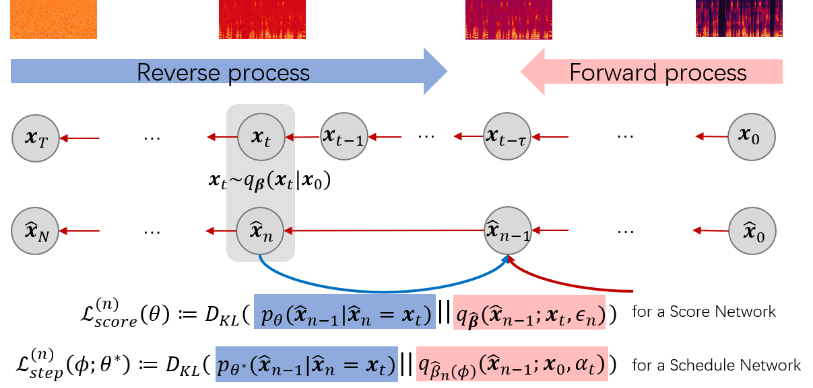

# Bilateral Denoising Diffusion Models (BDDMs)

[](https://github.com/tencent-ailab/bddm)

[](https://arxiv.org/abs/2203.13508)
[](https://bilateral-denoising-diffusion-model.github.io)


This is the official PyTorch implementation of the following paper:

> **BDDM: BILATERAL DENOISING DIFFUSION MODELS FOR FAST AND HIGH-QUALITY SPEECH SYNTHESIS** \
> Max W. Y. Lam, Jun Wang, Dan Su, Dong Yu

> **Abstract**: *Diffusion probabilistic models (DPMs) and their extensions have emerged as competitive generative models yet confront challenges of efficient sampling. We propose a new bilateral denoising diffusion model (BDDM) that parameterizes both the forward and reverse processes with a schedule network and a score network, which can train with a novel bilateral modeling objective. We show that the new surrogate objective can achieve a lower bound of the log marginal likelihood tighter than a conventional surrogate. We also find that BDDM allows inheriting pre-trained score network parameters from any DPMs and consequently enables speedy and stable learning of the schedule network and optimization of a noise schedule for sampling. Our experiments demonstrate that BDDMs can generate high-fidelity audio samples with as few as three sampling steps. Moreover, compared to other state-of-the-art diffusion-based neural vocoders, BDDMs produce comparable or higher quality samples indistinguishable from human speech, notably with only seven sampling steps (143x faster than WaveGrad and 28.6x faster than DiffWave).*

> **Paper**: Published at ICLR 2022 on [OpenReview](https://openreview.net/pdf?id=L7wzpQttNO)



This implementation supports model training and audio generation, and also provides the pre-trained models for the benchmark [LJSpeech](https://keithito.com/LJ-Speech-Dataset/) and [VCTK](https://datashare.ed.ac.uk/handle/10283/2651) dataset.

Visit our [demo page](https://bilateral-denoising-diffusion-model.github.io) for audio samples.

**Update:** We recently released our follow-up work FastDiff [here](https://github.com/Rongjiehuang/FastDiff), where the speed-and-quality trade-off is further optimized for the speech synthesis tasks.

### Recipes:

- (Option 1) To train the BDDM scheduling network yourself, you can download the pre-trained score network from [philsyn/DiffWave-Vocoder](https://github.com/philsyn/DiffWave-Vocoder/blob/master/exp/ch128_T200_betaT0.02/logs/checkpoint/1000000.pkl) (provided at ```egs/lj/DiffWave.pkl```), and follow the training steps below. **(Start from Step I.)**
- (Option 2) To search for noise schedules using BDDM, we provide a pre-trained BDDM for LJSpeech at ```egs/lj/DiffWave-GALR.pkl``` and for VCTK at ```egs/vctk/DiffWave-GALR.pkl``` . **(Start from Step III.)**
- (Option 3) To directly generate samples using BDDM, we provide the searched schedules for LJSpeech at ```egs/lj/noise_schedules``` and for VCTK at ```egs/vctk/noise_schedules``` (check ```conf.yml``` for the respective configurations). **(Start from Step IV.)**


## Getting Started

We provide an example of how you can generate high-fidelity samples using BDDMs.

To try BDDM on your own dataset, simply clone this repo in your local machine provided with NVIDIA GPU + CUDA cuDNN and follow the below intructions.

### Dependencies

- [pytorch](https://github.com/pytorch/pytorch)>=1.7.1
- [librosa](https://github.com/librosa/librosa)>=0.7.1
- [pystoi](https://github.com/mpariente/pystoi)==0.3.3
- [pypesq](https://github.com/youngjamespark/python-pypesq)==0.2.0

### Step I. Data Preparation and Configuraion ### 

Download the [LJSpeech](https://keithito.com/LJ-Speech-Dataset/) dataset.

For training, we first need to setup a file **conf.yml** for configuring the data loader, the score and the schedule networks, the training procedure, the noise scheduling and sampling parameters.

**Note:** Appropriately modify the paths in ```"train_data_dir"``` and ```"valid_data_dir"``` for training; and the path in ```"gen_data_dir"``` for sampling. All dir paths should be link to a directory that store the waveform audios (in **.wav**) or the Mel-spectrogram files (in **.mel**).

### Step II. Training a Schedule Network ###

Suppose that a well-trained score network (theta) is stored at ```$theta_path```, we start by modifying ```"load": $theta_path``` in **conf.yml**.

After modifying the relevant hyperparameters for a schedule network (especially ```"tau"```), we can train the schedule network (f_phi in paper) using:

```bash
# Training on device 0
sh train.sh 0 conf.yml
```

**Note**: In practice, we found that **10K** training steps would be enough to obtain a promising scheduling network. This normally takes no more than half an hour for training with one GPU.

### Step III. Searching for Noise Schedules ###

Given a well-trained BDDM (theta, phi), we can now run the noise scheduling algorithm to find the best schedule (optimizing the trade-off between quality and speed).

First, we set ```"load"``` in ```conf.yml``` to the path of the trained BDDM.

After setting the maximum number of sampling steps in scheduling (```"N"```), we run:

```bash
# Scheduling on device 0
sh schedule.sh 0 conf.yml
```

### Step IV. Evaluation or Generation ###

For evaluation, we set ```"gen_data_dir"``` in ```conf.yml``` to the path of a directory that stores the test set of audios (in ```.wav```).

For generation, we set ```"gen_data_dir"``` in ```conf.yml``` to the path of a directory that stores the Mel-spectrogram (by default in ```.mel``` generated by [TacotronSTFT](https://github.com/NVIDIA/tacotron2/blob/master/layers.py) or by our dataset loader ```bddm/loader/dataset.py```).

Then, we run:

```bash
# Generation/evaluation on device 0 (only support single-GPU scheduling)
sh generate.sh 0 conf.yml
```

## Acknowledgements
This implementation uses parts of the code from the following Github repos:\
[Tacotron2](https://github.com/NVIDIA/tacotron2)\
[DiffWave-Vocoder](https://github.com/philsyn/DiffWave-Vocoder)\
as described in our code.

## Citations ##

```
@inproceedings{lam2022bddm,
  title={BDDM: Bilateral Denoising Diffusion Models for Fast and High-Quality Speech Synthesis},
  author={Lam, Max WY and Wang, Jun and Su, Dan and Yu, Dong},
  booktitle={International Conference on Learning Representations},
  year={2022}
}
```

## License ##

Copyright 2022 Tencent

Licensed under the Apache License, Version 2.0 (the "License");
you may not use this file except in compliance with the License.
You may obtain a copy of the License at

http://www.apache.org/licenses/LICENSE-2.0

Unless required by applicable law or agreed to in writing, software
distributed under the License is distributed on an "AS IS" BASIS,
WITHOUT WARRANTIES OR CONDITIONS OF ANY KIND, either express or implied.
See the License for the specific language governing permissions and
limitations under the License.

## Disclaimer ##

This is not an officially supported Tencent product.
